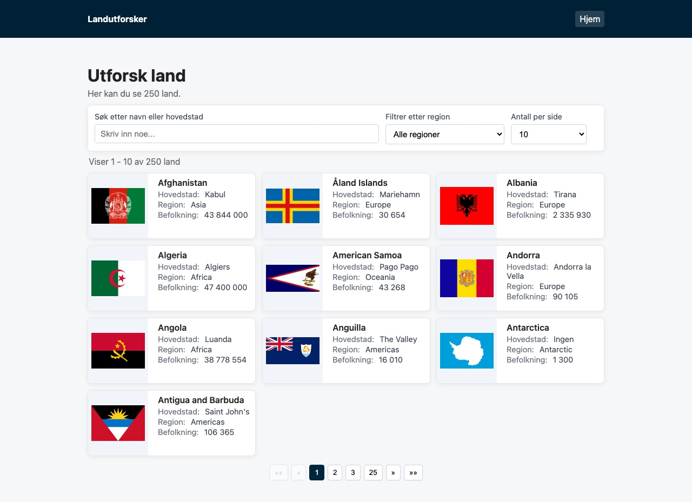
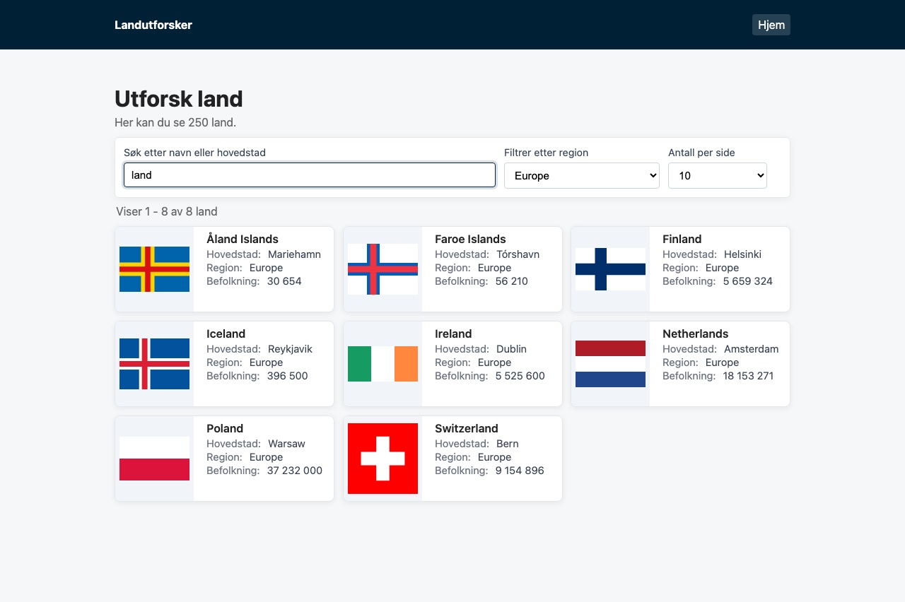
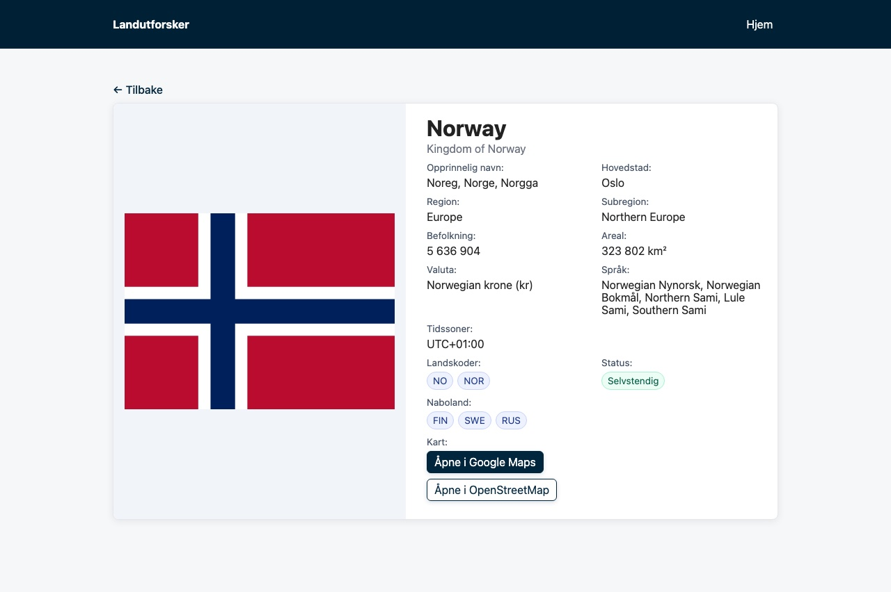
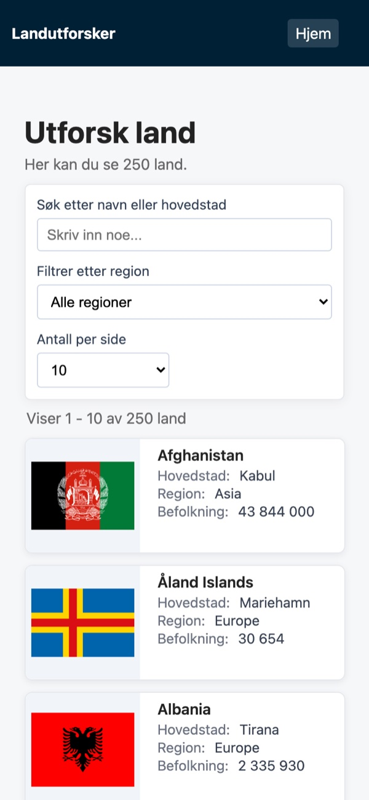
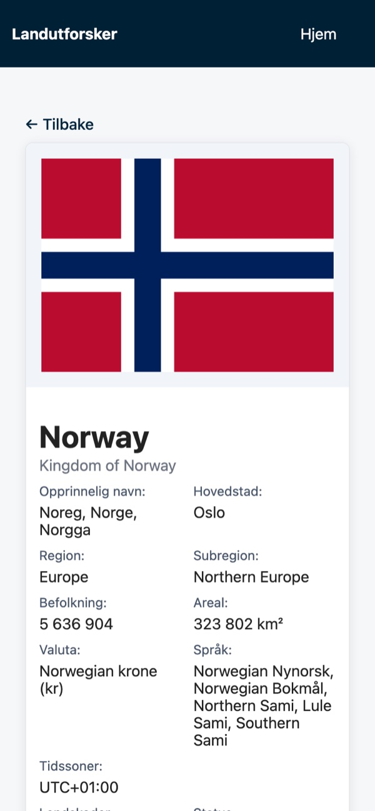

# Landutforsker 🌍

A small web app for exploring countries of the world, built with SvelteKit and the [REST Countries API](https://restcountries.com/).

This was my take home task for the technical interview at [**SmartGIS** ](https://www.smartgis.no/) in autumn 2025. It was part of the interview process, and in the end I got the job :) So this project means a lot to me, even though it's small.



## The task

The task was to make an app that fetches country data from REST Countries and shows it in a nice way. The requirements were:

1. A list of all countries with name, flag, population, region and capital
2. Pagination where you can choose how many results to show per page
3. A detail page for each country
4. Search and filtering

## What I built

- List of all countries, sorted by name
- Pagination with 5, 10, 25 or 50 countries per page, next/previous buttons and buttons to jump to the first and last page
- Search by country name or capital, and a filter by region. The list updates while you type
- Detail page with official and native name, capital, region, population, area, currency, languages, time zones, country codes and status (independent or not, landlocked)
- Neighbouring countries as links, so you can jump from country to country
- Links to Google Maps and OpenStreetMap
- Responsive layout for mobile and desktop
- Error messages if something goes wrong with the API

The browser never talks to REST Countries directly. It calls my own API routes in SvelteKit (`/api/countries` and `/api/countries/[code]`), and those call REST Countries on the server. That way the API key stays on the server and I can choose which fields to send to the browser.

## Screenshots

### Search and filter
Here I searched for "land" and filtered on Europe.



### Country page



### Mobile

<p align="center">
  
  &nbsp;
  
</p>

## Tech used

- [SvelteKit](https://svelte.dev/docs/kit) and Svelte
- TypeScript
- Vite
- REST Countries API
- Plain CSS

## How to run it

You need Node.js 20.19 or newer and a free API key from [restcountries.com](https://restcountries.com/sign-up).

```bash
git clone https://github.com/nebedolagaa/landutforsker.git
cd landutforsker
npm install
cp .env.example .env
```

Put your API key in `.env`:

```
REST_COUNTRIES_API_KEY=your-key-here
```

Then start the dev server and open http://localhost:5173:

```bash
npm run dev
```

## Project structure

```text
src/
  lib/
    api/countries.ts           fetching from our own API, filtering and mapping for the list
    server/restcountries.ts    talks to REST Countries v5 on the server (API key, cache, mapping)
    types/country.ts           TypeScript types
  routes/
    +layout.svelte             header, footer and loading bar
    +page.svelte / +page.ts    country list with search, filter and pagination
    country/[code]/            detail page for one country
    api/countries/             API routes for all countries and one country
```

## What I would do differently now

- Do the search, filtering and pagination on the server instead of loading all countries at once
- Keep the search and page number in the URL, so you can share a link to a search
- Write some tests, especially for the filtering and pagination logic
